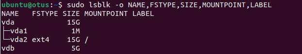
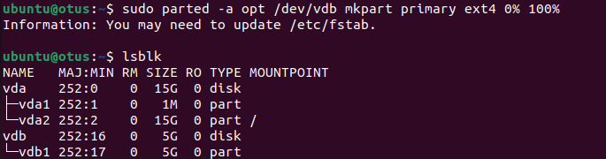
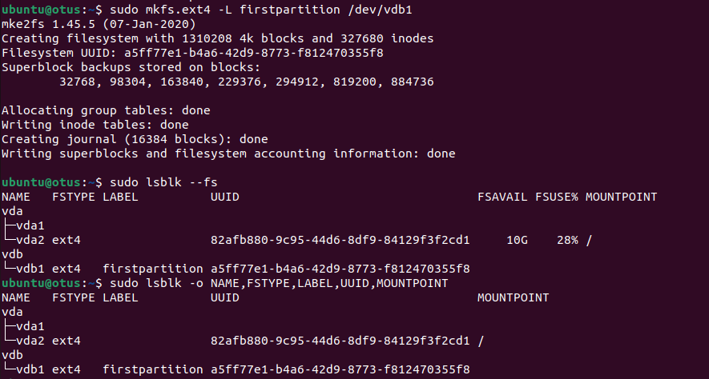
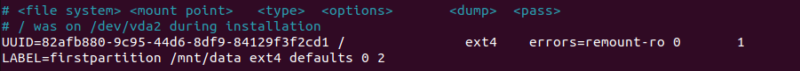
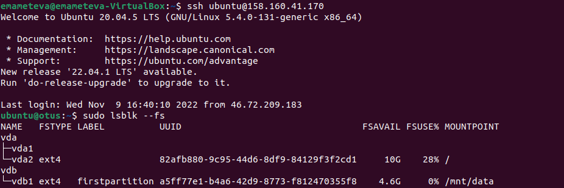
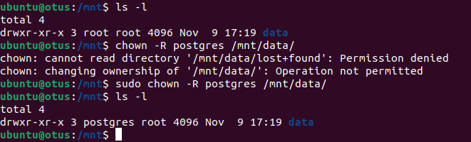
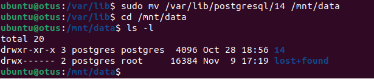
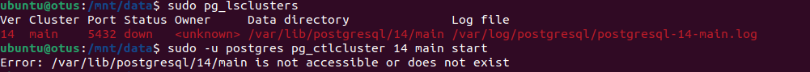
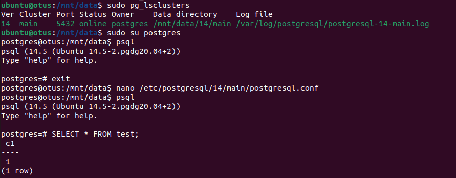

* Используем кластер PostgreSQL на ВМ ЯО.

* Создаем и присоединяем новый диск (назовем к примеру disc2, размером 5ГБ).

* Создаем в нем новый раздел (пусть будет занимать 100% памяти)

* Установим файловую систему ext4 и добавим лэйбл - firstpartition

* Монтируем файловую систему, предварительно создав директорию /mnt/data

* Добавляем запись в файл /etc/fstab, чтобы каждый раз при загрузке монтировалась файловая система. Пропишем по лэйблу.

* Перезагружаемся и проверяем что диск остается примонитрованным.

* Поменяем владельца папка на postgres.

* Перенесли содержимое /var/lib/postgres/14 в /mnt/data

Пытаемся запустить кластер, но безуспешно, т.к. он не находит директорию которую мы перенесли.

И подключиться к клиенту так же не получится

* Необходимо изменить конфигураионный файл postgresql.conf

* После чего успешно зашли в клиент, данные о тестовой таблице сохранились

